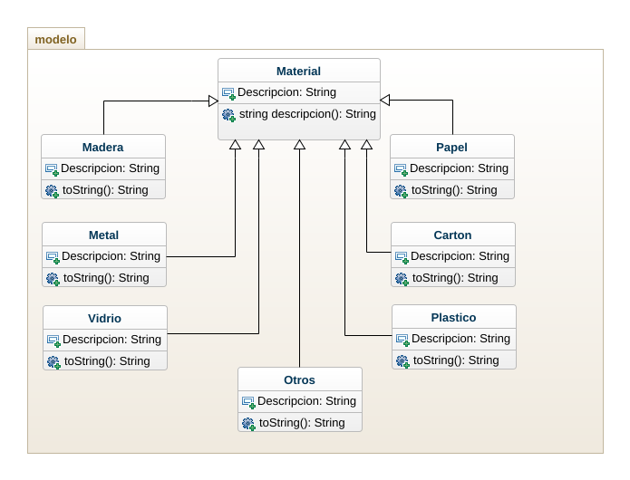

# RECICLAAP - Proyecto de PROGRAMACIÓN ORIENTADA A OBJETOS
## Este proyecto es una aplicación de escritorio que permite gestionar el reciclaje de residuos en una empresay o ayuda a las personas a reciclar en sus hogares.

## Diagrama de Clases

